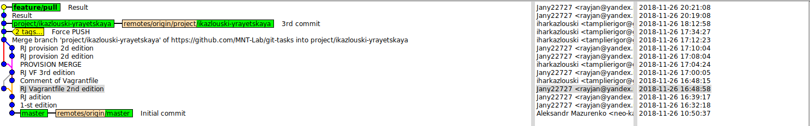

# GIT-Tasks
###			BY IKazlouski & YRayetskaya


## 1. Configuring Merge

```python
git checkout feature/merge project/ikazlouski-yrayetskaya
vim provision.sh 
git add provision.sh
git commit -m "RJ provision 2d edition"
git checkout project/ikazlouski-yrayetskaya
git merge feature/merge
git push origin project/ikazlouski-yrayetskaya
```

***
## 3. Configuring Rebase
```python
git checkout project/ikazlouski-yrayetskaya
git rebase featRebase3
git commit -m ""
git push origin project/ikazlouski-yrayetskaya
```

***
## 4. Force push
```python
git push --force  project/ikazlouski-yrayetskaya 
```
***
## 5. Tagging        
```python
vim provision    #changing file
git add provision.sh 
git tag -a v3.0.1 -m "Releasing provision.sh v3.0.1"
git tag -n3 
git show v3.0.1
git push origin v3.0.1
```
***

## Our work-tree

