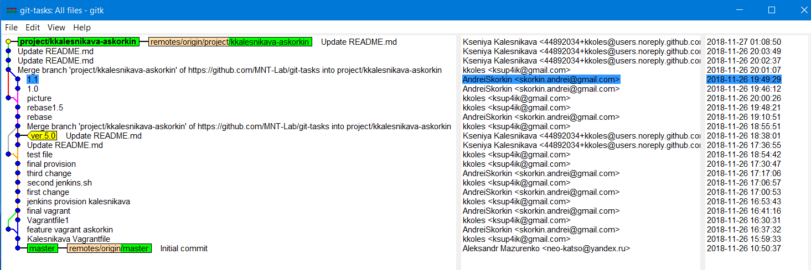

# Git-task
> Kseniya Kalesnikava, Andrei Skorkin
# Commit tree


Clone repository and create branch:
```
1.git clone https://github.com/MNT-Lab/git-tasks.git
  cd git-tasks/
  git ckeckout -b project/kkalesnikava-askorkin
```  
# 2. [COMMIT, PUSH]
Empty vagrantfile was created by kkoles:
```
vi Vagrantfile
git add .
git commit -m "Vagrant1.0"
git push origin project/kkalesnikava-askorkin 
```
We perform following command:
```
git pull origin  project/kkalesnikava-askorkin
```
# 3. [MERGE] 
And start change Vagrantfile at the same time
On our local repos we create feature branch:
```
git checkout -b feature1_kkalesnikava project/kkalesnikava-askorkin
[make some changes on file]
git commit -am "Vagrantfile1"
git checkout project/kkalesnikava-askorkin
git merge feature1_kkalesnikava
git push origin project/kkalesnikava-askorkin
```
#  [CONFLICT]
When Askorkin made his changes and tries to push he get conflict:
To https://github.com/MNT-Lab/git-tasks.git
! [rejected] project/kkalesnikava-askorkin -> project/kkalesnikava-askorkin (fetch first)
error: failed to push some refs to 'https://github.com/MNT-Lab/git-tasks.git'
hint: Updates were rejected because the remote contains work that you do
hint: not have locally. This is usually caused by another repository pushing
hint: to the same ref. You may want to first merge the remote changes (e.g.,
hint: 'git pull') before pushing again.
hint: See the 'Note about fast-forwards' in 'git push --help' for details.

to resolve conflict he 
```
git add .
```
Open file (file consist of 2 parts: KKalesnikava changes and ASkorkin changes) and decide which lines put to final version (delete unnecessary lines), and then:
```
git commit -m "final vagrant"
git push origin project/kkalesnikava-askorkin
```

# 4. [PULL] 
When created jenkins.sh, done some changes, and other 
```
git pull origin project/kkalesnikava-askorkin
```
# 5. [REBASE] 
```
git rebase project/kkalesnikava-askorkin feature1_kkalesnikava
```
